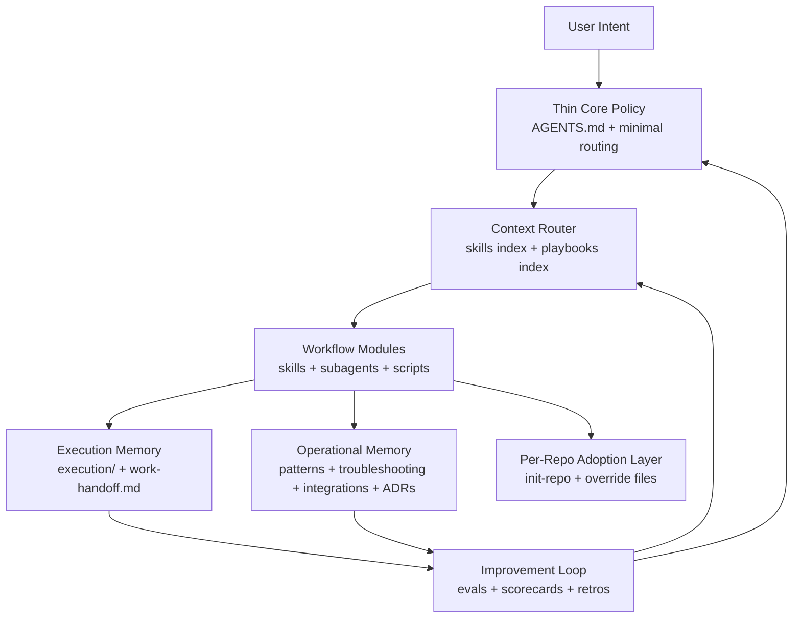

# Plan — Harness Operating Model Reboot

## Context

The current `.agents` harness already has the major building blocks:
shared policy, skills, subagents, tracking, learnings, evals, hooks, and
project scaffolding. The problem is no longer missing surface area. The problem
is that the operating model has stalled.

User goals driving this reboot:

- manage company work through AI, not just coding tasks
- use Claude and Codex interchangeably with shared markdown, skills, and
  subagents
- reduce prompt-token waste from large default instructions
- keep learning and troubleshooting growing over time instead of freezing
- capture repeat failure modes so the same AI mistakes are less likely
- support coding, communication, documentation, and third-party integrations
- keep per-repo artifacts team-safe with no personal residue in commits
- leave a durable foundation so future sessions can continue improving the
  harness instead of restarting from scratch

Constraints and evidence:

- The supplied Stave task ids are not present inside the local `.agents`
  repository, so the plan relies on repo evidence and the current user brief.
- `ROADMAP.md` says all initial phases are complete, but the repo does not yet
  show a living improvement loop.
- `evals/results/` is empty.
- `learnings/` is a flat set of topic files with no freshness or ingestion
  mechanism.
- The most recent `work-handoff.md` still pointed at the tracking refactor,
  not this larger harness reboot.

## Refactoring Goal

- **What**: Reboot `.agents` from a static configuration bundle into a
  sustainable AI operating system for engineering and managerial work.
- **Why**: The harness has strong foundations but weak compounding loops:
  tracking is not clearly valuable, learnings are static, integrations are not
  first-class operating modules, and the roadmap does not govern active
  evolution.
- **Target state**: A thin always-on core, indexed on-demand modules,
  structured operational memory, measurable improvement loops, and explicit
  cross-agent handoff contracts.
- **Constraints**: Preserve cross-agent compatibility, avoid personal residue in
  team repos, minimize default-token footprint, and keep migration incremental
  enough to verify in real use.

## Diagnosis

### What is working

- Shared policy and shared skill assets already exist.
- Claude and Codex can converge on the same artifacts even if the enforcement
  mechanism differs.
- Repo-level scaffolding already protects team repos from personal-path
  leakage.
- The recent tracking simplification correctly reduced paperwork.

### What is not working

- `tracking/` is still treated as a strategic memory candidate even though it
  only makes sense as execution memory.
- `learnings/` is passive; there is no ingestion, curation, freshness, or
  retirement workflow.
- `ROADMAP.md` behaves like a build-complete announcement instead of an active
  portfolio of next bets.
- `evals/` exists, but the measurement loop is not active because no results
  are being produced and reviewed.
- Troubleshooting knowledge is not a first-class asset, even though repeated AI
  failure modes are one of the user's main pain points.
- Integrations exist as tools, but not as reusable operating playbooks.
- The always-on prompt surface is still larger than it should be for daily
  work.

### Core strategic shift

The harness should be reorganized around four distinct memory types:

1. **Core policy**: the minimum always-loaded rules and routing hints.
2. **Execution memory**: active task state and handoff artifacts.
3. **Operational memory**: reusable troubleshooting, patterns, integration
   caveats, and durable decisions.
4. **Improvement memory**: eval results, scorecards, and retrospectives that
   decide what to change next.

Execution memory should live under `execution/`. The old `tracking/` lane is no
longer part of the live harness model.

## Scope Analysis

### Moves / Reshapes

| Path / Area | Change | Why |
|---|---|---|
| `AGENTS.md` + always-read docs | Shrink to a thinner always-on core | Reduce token cost and default noise |
| `learnings/` | Rebuild into a maintained operational memory system | Current flat files do not compound |
| `ROADMAP.md` | Turn into an active portfolio with draft/in-progress/validated states | Current roadmap reads as already finished |
| `evals/` | Promote from dormant asset to required improvement loop input | Measure whether changes help |
| `skills/` and `skills/INDEX.md` | Add stronger routing metadata and context-budget discipline | Skills should carry most of the on-demand detail |
| integration usage | Add reusable playbooks for Slack, GitHub, Jira, Figma, and future MCP flows | Tool access alone does not create workflow leverage |

### Stays

| Path / Area | Reason |
|---|---|
| `ARCHITECTURE.md` | Still the right place for structural truth |
| `skills/` | Still the primary portable behavior layer |
| `subagents/` | Still useful for bounded discover/review/planning work |
| `scripts/init-repo.sh` | Team-friendly repo scaffolding remains essential |
| `work-handoff.md` | Still useful as cross-session scratch state |
| bridge files in `claude/` and `codex/` | Thin shared-entry model is still correct |

### Breaks / Cross-Cutting Concerns

| Concern | Current state | Resolution |
|---|---|---|
| references to `learnings/` in docs | Assume a flat knowledge bucket | Introduce a migration path and update doc references incrementally |
| execution-memory root naming | Historically overloaded under `tracking/` | Promote `execution/` as the sole durable root |
| roadmap governance | No explicit draft / active / retired workflow | Add a portfolio-style lifecycle to `ROADMAP.md` |
| prompt budget | Rules and guidance are spread across multiple docs | Define a thin-core loading boundary and an index-first access model |
| troubleshooting capture | Implicit or ad hoc | Add a dedicated recurring-failure system with curation rules |

## Target Architecture

### Proposed artifact model

- **Thin core**: `AGENTS.md`, a reduced `RESPONSE_STYLE.md`, and only the
  minimum routing/default rules that must always be known.
- **Indexed modules**: lightweight index files that point the agent to the
  exact skill, playbook, or troubleshooting area to load on demand.
- **Operational memory**: a maintained system for durable knowledge, likely
  covering:
  - reusable engineering patterns
  - recurring AI failure modes and fixes
  - third-party integration playbooks
  - durable harness decisions
- **Execution memory**: active task records and handoff state only.
- **Improvement loop**: a required review path from completed work into
  learnings, evals, or playbook updates when justified.

## Execution Plan

1. **Phase 0 — Reassessment baseline**
   - Capture the operating-model diagnosis and decisions in tracked planning
     artifacts.
   - Mark the roadmap as actively under reassessment.
   - Settle the execution-memory naming strategy with a compatibility path.

2. **Phase 1 — Thin-core prompt reduction**
   - Audit what must be always loaded versus index-only.
   - Move bulky guidance out of the default path where possible.
   - Introduce a context-budget rule for new docs and skills.
   - Verification:
     - a cold-start session can still route correctly without loading deep docs
     - the default instruction surface is measurably smaller

3. **Phase 2 — Memory model redesign**
   - Promote `execution/` as the durable execution-memory root.
   - Replace or restructure `learnings/` into a curated operational memory
     system with explicit categories and update rules.
   - Add a troubleshooting knowledge lane for repeated AI failure modes.
   - Add a durable decisions lane for harness-level architecture choices.
   - Verification:
     - at least one completed task produces a durable troubleshooting or
       pattern artifact
     - stale memory can be identified and retired

4. **Phase 3 — Workflow and integration playbooks**
   - Package high-value external-tool workflows as shared operating playbooks,
     not just tool availability.
   - Focus first on Slack, GitHub, Jira/Confluence, and repo-init workflows.
   - Ensure Claude and Codex can follow the same artifact contracts even if the
     connector APIs differ.
   - Verification:
     - at least two real workflows can be resumed cross-agent with no chat
       replay
     - per-repo outputs stay team-safe and committable

5. **Phase 4 — Measurement and growth loop**
   - Require actual eval runs for significant harness changes.
   - Add a small scorecard for harness health: prompt size, repeated failure
     classes, eval pass rate, handoff quality, and stale-memory count.
   - Introduce a lightweight retrospective cadence so the roadmap reflects
     evidence instead of assumptions.
   - Verification:
     - `evals/results/` has real data
     - the roadmap references evidence, not just intent

6. **Phase 5 — Adoption and migration cleanup**
   - Migrate docs and scripts that depend on the old learning/tracking shape.
   - Remove or archive obsolete guidance.
   - Confirm the reboot model works in one or more real project repos.
   - Verification:
     - no broken references
     - init flow and daily workflows still function

## Implementation Update — 2026-04-07

Delivered in the first reboot slice:

- `docs/instructions/CONTEXT_LOADING.md` to formalize thin-core loading
- `memory/` scaffolding for patterns, troubleshooting, playbooks, decisions,
  and scorecards
- an ADR-style operating-model reboot decision record
- a troubleshooting record for the `python3` Command Line Tools bootstrap stub
- a scorecard baseline for future comparison
- a shell-only `work-handoff.md` update path in `scripts/new-task.sh`
- core doc updates so `execution/` means execution memory and `memory/`
  means operational memory

Still pending for later slices:

- none required for this reboot task

## Implementation Update — 2026-04-07 (second slice)

Delivered after resuming from the earlier Stave planning task:

- populated `memory/playbooks/` with reusable workflows for:
  - GitHub PR review and follow-up
  - Slack thread to task and Jira setup
  - repo bootstrap and handoff hygiene
  - harness change rollout and validation
- recorded the first real eval result in `evals/results/2026-04-07_codex_06.md`
- added a follow-up scorecard snapshot in
  `memory/scorecard/2026-04-07-first-playbooks-and-eval.md`
- verified the slice with:
  - `bash scripts/check-harness.sh`
  - `git diff --check`

## Implementation Update — 2026-04-08 (third slice)

Delivered while continuing from the reboot handoff:

- removed the active `python3` dependency from:
  - `scripts/init.sh`
  - `scripts/hooks/pre-commit-lint.sh`
  - `scripts/hooks/pre-write-secrets.sh`
  - `scripts/hooks/post-write-format.sh`
  - `scripts/hooks/on-stop-handoff.sh`
- updated `scripts/check-harness.sh` to assert the active init/hook path stays
  python-free
- verified the slice with:
  - `bash -n scripts/init.sh scripts/check-harness.sh scripts/hooks/pre-commit-lint.sh scripts/hooks/pre-write-secrets.sh scripts/hooks/post-write-format.sh scripts/hooks/on-stop-handoff.sh`
  - representative hook payload smoke tests
  - a temp-`HOME` run of `bash scripts/init.sh` plus
    `bash scripts/check-harness.sh`
  - a temp workspace run of `scripts/hooks/on-stop-handoff.sh`
  - `bash scripts/check-harness.sh`
  - `git diff --check`

## Implementation Update — 2026-04-08 (fourth slice)

Delivered after the init/hook portability cleanup:

- removed the remaining Python dependency from `scripts/summarize-evals.py`
  while preserving the script path for compatibility
- updated `evals/README.md` to use direct script execution
- recorded a second real eval result in `evals/results/2026-04-08_codex_06.md`
- added a new scorecard snapshot in
  `memory/scorecard/2026-04-08-python-free-eval-summary-and-second-resume-run.md`
- verified the slice with:
  - direct execution of `scripts/summarize-evals.py`
  - `bash scripts/check-harness.sh`
  - `git diff --check`

## Implementation Update — 2026-04-08 (fifth slice)

Delivered after the eval-summary portability cleanup:

- added `memory/playbooks/eval-run-scoring-and-scorecard-update.md` to codify
  the now-proven eval logging workflow
- recorded a non-`06` eval result in `evals/results/2026-04-08_codex_04.md`
- refreshed the same-day scorecard snapshot so the metrics now reflect:
  - 5 active playbooks
  - 3 real eval results
  - benchmark history spanning at least two task types
- verified the slice with:
  - `scripts/summarize-evals.py`
  - `bash scripts/check-harness.sh`
  - `git diff --check`

## Implementation Update — 2026-04-08 (sixth slice)

Delivered after the eval-operations playbook slice:

- added `memory/playbooks/stave-task-resume-and-local-execution-bridge.md`
  based on the actual Stave continuation workflow used in this task
- recorded a prompt-refinement eval result in
  `evals/results/2026-04-08_codex_10.md`
- added a new scorecard snapshot in
  `memory/scorecard/2026-04-08-stave-bridge-and-prompt-refinement-eval.md`
- verified the slice with:
  - `scripts/summarize-evals.py`
  - `bash scripts/check-harness.sh`
  - `git diff --check`

## Implementation Update — 2026-04-08 (seventh slice)

Delivered after the Stave-bridge and prompt-refinement slice:

- promoted `execution/` to the default durable execution-memory root for new
  work while preserving `tracking/` as a legacy compatibility lane
- updated the core docs, `scripts/new-task.sh`, and
  `scripts/init-repo.sh` so new task scaffolding defaults to
  `execution/sessions/...`
- recorded the naming decision in
  `memory/decisions/2026-04-08-execution-memory-default-path.md`
- added
  `memory/playbooks/figma-design-to-implementation-and-visual-verification.md`
  as the next connector-heavy workflow contract
- added `memory/scorecard/2026-04-08-execution-default-and-figma-playbook.md`
- verified the slice with:
  - `bash -n scripts/new-task.sh scripts/init-repo.sh scripts/init.sh scripts/check-harness.sh`
  - a temp run of `scripts/new-task.sh demo feature task-one --mode expanded`
  - a temp run of `scripts/init-repo.sh <tmp/project> --with-execution`
  - `scripts/summarize-evals.py`
  - `bash scripts/check-harness.sh`
  - `git diff --check`

## Implementation Update — 2026-04-08 (eighth slice)

Delivered as the final cleanup and close-out pass:

- moved durable task records from `tracking/` into `execution/`
- removed `--with-tracking`, `HARNESS_TASK_ROOT`, and legacy scratch fallback
  support
- renamed the task scaffolder to `scripts/new-task.sh`
- renamed the Stave continuation playbook to
  `memory/playbooks/stave-task-resume-and-local-execution-bridge.md`
- deleted `claude-progress.txt`
- verified the slice with:
  - `bash -n scripts/new-task.sh scripts/init-repo.sh scripts/init.sh scripts/check-harness.sh`
  - a temp run of `scripts/new-task.sh demo feature task-one --mode expanded`
  - a temp run of `scripts/init-repo.sh <tmp/project> --with-execution`
  - `scripts/summarize-evals.py`
  - `bash scripts/check-harness.sh`
  - `git diff --check`

## Success Metrics

- Default prompt surface is materially smaller and easier to reason about.
- Future sessions can locate the current reboot status from `ROADMAP.md`,
  `work-handoff.md`, and the active task record without replaying chat.
- Repeated AI failure modes are captured in a reusable troubleshooting system.
- `evals/results/` contains actual comparative runs, not only task templates.
- Claude and Codex can hand work off through shared artifacts with minimal
  translation.
- Repo-level outputs remain safe to commit in shared team environments.
- The execution-memory path is settled with no compatibility layer.

## Risks / Rollback

| Risk | Impact | Likelihood | Mitigation |
|---|---|---|---|
| Over-designing the reboot before trying it in real work | High | Medium | Ship the reboot incrementally and validate each phase on real tasks |
| Breaking existing skill/doc references while reorganizing memory | Medium | Medium | Prefer additive migration first; remove old paths only after references are updated |
| Shrinking the core too far and harming routing quality | High | Medium | Keep thin-core changes reversible and test with evals plus real sessions |
| Introducing a maintenance-heavy memory system | Medium | High | Make update rules explicit and tie them to actual task completion or retros, not goodwill |
| Historical notes still mention old `tracking/` names | Low | Medium | Treat them as historical context only; keep live docs and tooling on `execution/` |

## Done Criteria

- A durable reboot plan exists and reflects the user's goals.
- The current harness weaknesses are documented with repo evidence.
- The target operating model and migration phases are explicit.
- The live harness no longer depends on `tracking/` or legacy scratch support.
