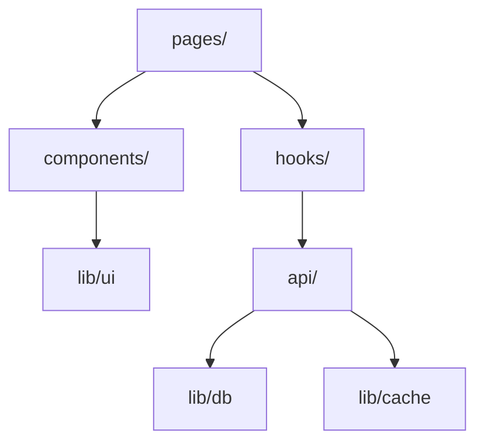

# The Codebase Mapper

Systematic codebase analysis producing structured maps, diagrams, and onboarding guides.

## Use This Skill When

- Entering an unfamiliar codebase for the first time.
- Preparing for large-scale refactoring (need full picture first).
- Onboarding someone (or yourself) to a project.
- The user asks to "map", "analyze structure", "understand this codebase".

## Do Not Use This Skill When

- You already know the codebase well (just work directly).
- The task is small and localized (< 3 files involved).
- The user wants code review (use the-code-reviewer).

## Workflow

### Step 1 — Project Fingerprint

Quickly identify the project type and stack:

1. Check manifest files: `package.json`, `pyproject.toml`, `Cargo.toml`, `go.mod`
2. Check framework markers: `next.config.*`, `vite.config.*`, `tsconfig.json`, `Dockerfile`
3. Check CI: `.github/workflows/`, `.gitlab-ci.yml`, `Jenkinsfile`
4. Check entry points: `src/index.*`, `src/main.*`, `app/`, `pages/`, `server/`

Output:
```
## Project Fingerprint
- **Name**: {from manifest}
- **Type**: {monorepo | single-app | library | service}
- **Stack**: {language, framework, runtime}
- **Build**: {bundler, test runner, CI}
- **Entry points**: {list}
```

### Step 2 — Directory Structure Analysis

Map the top-level directory purpose:

```
## Directory Map
| Directory | Purpose | Key files |
|---|---|---|
| src/components/ | React UI components | Button.tsx, Modal.tsx, ... |
| src/api/ | API route handlers | auth.ts, users.ts, ... |
| src/lib/ | Shared utilities | db.ts, cache.ts, ... |
| ... | ... | ... |
```

For monorepos, map packages/workspaces first, then drill into the primary package.

### Step 3 — Module Dependency Map

Generate a Mermaid diagram showing module dependencies:



Rules:
- Show directory-level dependencies, not file-level (too noisy).
- Highlight circular dependencies with red edges.
- Mark external service connections (DB, cache, APIs) as distinct nodes.
- Keep to max 15-20 nodes; group small modules.

### Step 4 — Request Flow Traces

Trace 2-3 representative request flows through the system:

```
## Request Flow: User Login
1. Client: `pages/login.tsx` → form submit
2. API: `POST /api/auth/login` → `src/api/auth.ts:handleLogin()`
3. Service: `src/services/auth.ts:authenticate()` → validates credentials
4. DB: `src/lib/db.ts:query()` → users table lookup
5. Response: JWT token → set cookie → redirect to dashboard
```

Choose flows that cover:
- The most common user action
- A write operation (data mutation)
- An integration point (external service, webhook, etc.)

### Step 5 — Key Abstractions & Patterns

Identify the architectural patterns in use:

```
## Patterns
- **State management**: Zustand stores in `src/stores/`
- **Data fetching**: TanStack Query with custom hooks in `src/hooks/`
- **API layer**: Hono routes in `src/api/`, validated with Zod schemas
- **Auth**: JWT-based, middleware in `src/middleware/auth.ts`
- **Error handling**: Custom AppError class, global error boundary
```

### Step 6 — Risk & Tech Debt Annotations

Flag areas of concern:

```
## Risk Areas
- ⚠️ `src/lib/legacy-auth.ts` — deprecated auth module, still imported by 3 files
- ⚠️ `src/api/billing.ts` — no test coverage, handles payment data
- ⚠️ Circular dependency: `hooks/ ↔ stores/`
- 📏 `src/components/Dashboard.tsx` — 800 lines, god component
```

### Step 7 — Onboarding Guide

Produce a concise "start here" guide:

```
## Onboarding Guide

### Quick Start
1. Install: `bun install`
2. Dev server: `bun dev`
3. Tests: `bun test`

### Where to Look First
- **Adding a page**: `src/pages/` — follow existing page pattern
- **Adding an API**: `src/api/` — add route + Zod schema
- **Adding a component**: `src/components/` — use shadcn/ui base

### Key Concepts
- {concept-1}: {brief explanation + where to find it}
- {concept-2}: {brief explanation + where to find it}

### Gotchas
- {gotcha-1}: {what to watch out for}
```

## Output Format

Combine all steps into a single markdown document. If the user asked for a specific part
(e.g., "just the module map"), produce only that section.

## Integration with Other Skills

- **researcher subagent**: Spawn for Step 2-4 if codebase is very large (> 200 files)
- **the-refactoring-planner**: Feed the codebase map as input for refactoring scope analysis
- **the-improvement-loop**: Use the risk annotations as input for a tech-debt improvement loop

## Done Definition

The map is complete when:
- Project fingerprint identifies the stack and entry points.
- Module dependency diagram is generated (Mermaid).
- At least 2 request flows are traced.
- Key patterns and risk areas are documented.
- Onboarding guide has actionable "start here" instructions.
