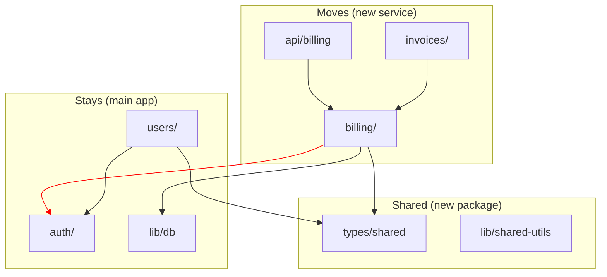

# The Refactoring Planner

Structured planning for large-scale refactoring, module extraction, and product separation.

## Use This Skill When

- Planning a multi-file, multi-sprint refactoring.
- Extracting a module or service from a monolith.
- Separating a product into independent deployables.
- The user says "리팩토링 계획", "plan refactoring", "모듈 분리".

## Do Not Use This Skill When

- The refactor is small (< 5 files, single PR).
- The user just wants code review of an existing refactor (use the-code-reviewer).
- The user wants implementation, not planning (just do it).

## Prerequisites

- Codebase map (use the-codebase-mapper first if the codebase is unfamiliar).
- Clear goal from the user: what is being extracted/restructured and why.

## Workflow

### Step 1 — Define the Refactoring Goal

Clarify with the user:

```
## Refactoring Goal
- **What**: {what is being refactored — module, service, feature area}
- **Why**: {motivation — scaling, team ownership, compliance, tech debt}
- **Target state**: {what the end result looks like}
- **Constraints**: {timeline, backward compatibility, zero-downtime, etc.}
```

### Step 2 — Scope Analysis (What Moves, What Stays, What Breaks)

Analyze the codebase to partition into three buckets:

```
## Scope Analysis

### Moves (to new location/service)
| Path | Type | Dependencies | Notes |
|---|---|---|---|
| src/billing/ | directory | db, auth, email | Core extraction target |
| src/api/billing.ts | file | billing/, zod | API routes |
| ... | ... | ... | ... |

### Stays (remains in current location)
| Path | Reason |
|---|---|
| src/auth/ | Shared across products |
| src/lib/db.ts | Infrastructure layer |

### Breaks (cross-cutting concerns that need resolution)
| Concern | Current state | Resolution |
|---|---|---|
| Shared types | `src/types/billing.ts` imported by 12 files | Extract to shared package |
| Auth middleware | Billing routes use `src/middleware/auth.ts` | Copy or shared library |
| Database | Single database, shared tables | Schema separation plan needed |
```

### Step 3 — Dependency Graph Partitioning

Generate a Mermaid diagram showing the partition boundary:



Red edges = cross-boundary dependencies that need resolution.

### Step 4 — Migration Phases

Break the refactoring into safe, incremental phases:

```
## Migration Phases

### Phase 1: Preparation (no behavior change)
- [ ] Extract shared types to `packages/shared-types/`
- [ ] Add barrel exports at module boundaries
- [ ] Add integration tests at cut points
- [ ] Estimated: {time}

### Phase 2: Internal restructuring (no external API change)
- [ ] Move billing logic to `packages/billing/`
- [ ] Update imports across the codebase
- [ ] Verify all tests pass
- [ ] Estimated: {time}

### Phase 3: Service boundary (API separation)
- [ ] Create billing service API
- [ ] Add inter-service communication layer
- [ ] Dual-write period for data migration
- [ ] Estimated: {time}

### Phase 4: Cutover
- [ ] Route traffic to new service
- [ ] Remove old code paths
- [ ] Verify monitoring and rollback plan
- [ ] Estimated: {time}
```

Each phase must be:
- **Independently deployable** — can ship without completing the next phase.
- **Reversible** — can roll back to previous phase without data loss.
- **Testable** — has clear verification criteria.

### Step 5 — Risk Matrix

```
## Risk Matrix

| Risk | Impact | Likelihood | Mitigation |
|---|---|---|---|
| Shared DB schema breakage | High | Medium | Dual-write with feature flag |
| Auth flow disruption | High | Low | Keep auth shared, don't extract |
| Data inconsistency during migration | High | Medium | Reconciliation job + monitoring |
| Team velocity drop during refactor | Medium | High | Limit to 1 phase per sprint |
| Circular dependency introduced | Low | Medium | CI check for import cycles |
```

### Step 6 — Tracking Integration

If the user approves the plan, auto-generate tracking artifacts:

1. Create a tracked task per phase using `scripts/new-tracked-task.sh`
2. Populate `plan.md` with the scope analysis
3. Populate `phases.md` with the migration phases
4. Populate `tasks.md` with the checklist items

## Output Format

Produce a single markdown document with all sections. The user can then:
- Review and adjust phases
- Approve and start implementation
- Share with the team for alignment

## Integration with Other Skills

- **the-codebase-mapper**: Run first to get the module map (input to Step 2)
- **the-tdd**: Use for adding integration tests at cut points (Phase 1)
- **the-improvement-loop**: Use post-refactoring to measure code quality improvement
- **the-pr-reviewer**: Review each phase's PR before merge

## Done Definition

The plan is complete when:
- Goal and constraints are documented.
- Scope analysis partitions code into moves/stays/breaks.
- Dependency diagram shows the partition boundary.
- Migration phases are defined with reversibility and verification criteria.
- Risk matrix covers high-impact scenarios with mitigations.
- User has reviewed and provided feedback.
